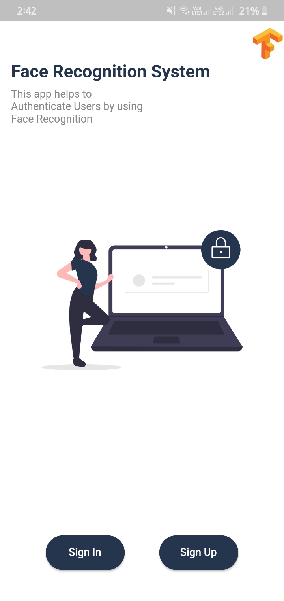
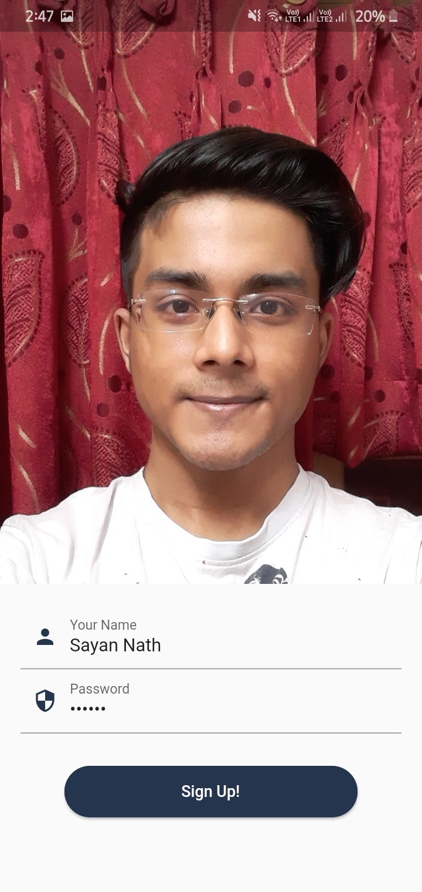
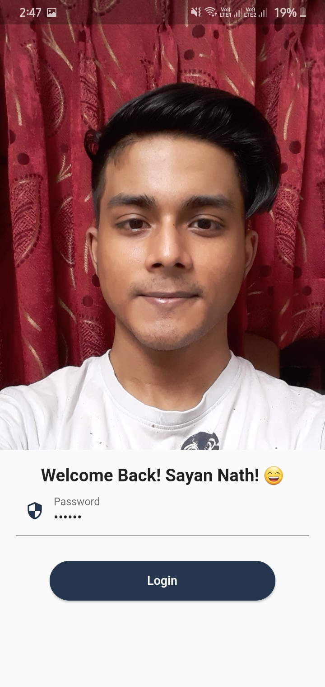

# Face Authentication App


> Face Authentication with TF-Line. Model architecture which is used is FaceNet.

## Screenshots

<p>
  

  <br>
  
<image height=400 width=200 src= "screenshots/five.jpeg">
  
</p>

## Project Structure
```
.
├── constants
│   └── ui_constants.dart
├── db
│   └── database.dart
├── main.dart
├── pages
│   ├── home.dart
│   ├── profile.dart
│   ├── sign-in.dart
│   ├── sign-up.dart
│   └── splashScreen.dart
├── services
│   ├── camera.service.dart
│   ├── facenet.service.dart
│   └── ml_vision_service.dart
└── widgets
    ├── FacePainter.dart
    ├── auth-action-button.dart
    └── display-picture-screen.dart

5 directories, 14 files
```

## How to run
```
1. Open your terminal
2. Copy the command 'git clone https://github.com/sayannath/Face-Authentication-App.git'
3. cd Face-Authentication-App
4. flutter pub get [Make sure Flutter is installed]
5. flutter run
```
## Want to Install Flutter?
[Click Here](https://flutter.dev/docs/get-started/install)

## Pull Request

Pull Requests are welcome. Please follow these rules for the ease of understanding:
* Make sure to check for available issues before raising one
* Give me a maximum of 24-48 hours to respond
* Have proper documentation on the parts you are changing/adding

## Developed & Maintained by

<a href="https:sayannath.biz">
  
</a>

[](https://github.com/sayannath)
<a href="https://www.buymeacoffee.com/sayannath235" target="_blank"></a>

<div align="center">
  
#### Show some ❤️ by starring the repository!
</div>
